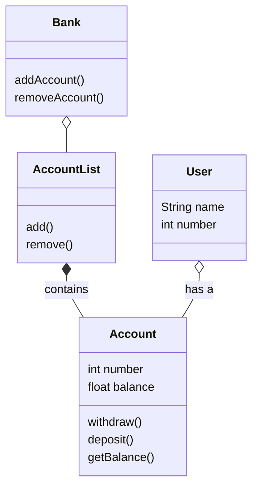

```mermaid
classDiagram
Account : int number
Account : float balance
Account : withdraw()
Account : deposit()
Account : getBalance()
Bank : addAccount()
Bank : removeAccount()
Bank o-- AccountList
AccountList : add()
AccountList : remove()
AccountList *-- Account : contains
User o-- Account : has a
User : String name
User: int number
```
